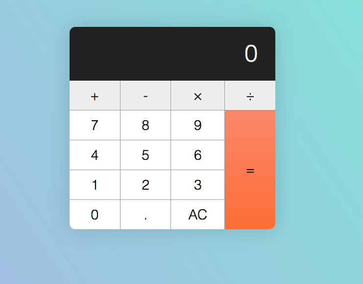

# JavaScriptCalculator
iOS Look-a-like JavaScript Calculator 
## Build
The calculator was built with understanding the following Js fundamentals: 
1. If/else statments
2. For loops
3. Functions
4. Arrow functions
5. && and || operators
6. How to change text with the 'textContent' property
7. How to add event listeners with the event delegation pattern
## Calculator Screenshot

## Credit
Tutorial :
 [Zell's Guide](https://zellwk.com/blog/calculator-part-1/?ck_subscriber_id=217327099)
